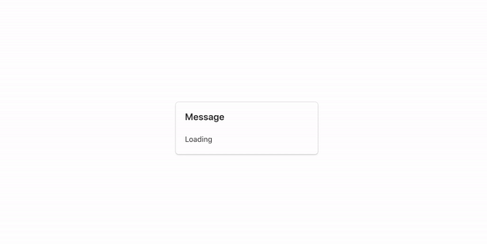

# Js React Status Indicator


#### Issue

I'm working on a computation-heavy web app and I want users to know the progression the computation so that the app doesn't appear as stale.

Basically I have three messages to indicate in state of the computation - 

* Loading

* 50% Finished

* 80% Finished

I created a `displayMsg` state in the `App` component, which get sent down as a prop to a child component `Copy`.  In the setter method for `displayMsg`, `setDisplayMsg`,  is invoked in different computation stages. However, I'm only seeing `Loading` and `80% Finished` while the intermediate stage, `50% Finished`, is skipped.


#### Expected Behavior 

Messages from all stages should show {"Loading", "50%", "80%"}




To reproduce - 

1. uncomment line 29 to 36 underneath`#OPTION1` in `React.useEffect` in the `App` component. Save.

   ```javascript
     React.useEffect(() => {
       // OPTION #1 - Desire Behavior
       setTimeout(() => {
         setDisplayMsg("50% Finished");
       }, 1000);
   
       setTimeout(() => {
         setDisplayMsg("80% Finished");
       }, 3000);
   
       // // OPTION #2 - "50% Finished" doesn't show
       // setDisplayMsg("50% Finished");
   
       // simulateHeavyComputation(3000);
   
       // setDisplayMsg("80% Finished");
     }, []);
   ```

2. open `index.html` in browser


#### Observed Behavior

**Only** Message from in the initial and ending stage showed {"Loading", "80%"}


To reproduce - 

1. uncomment line 38 to 43 underneath`#OPTION2` in  `React.useEffect` in the `App` component. Save.

   ```
     React.useEffect(() => {
       // // OPTION #1 - Desire Behavior
       // setTimeout(() => {
       //   setDisplayMsg("50% Finished");
       // }, 1000);
   
       // setTimeout(() => {
       //   setDisplayMsg("80% Finished");
       // }, 3000);
   
       // OPTION #2 - "50% Finished" doesn't show
       setDisplayMsg("50% Finished");
   
       simulateHeavyComputation(3000);
   
       setDisplayMsg("80% Finished");
     }, []);
   ```

2. open `index.html` in browser 

